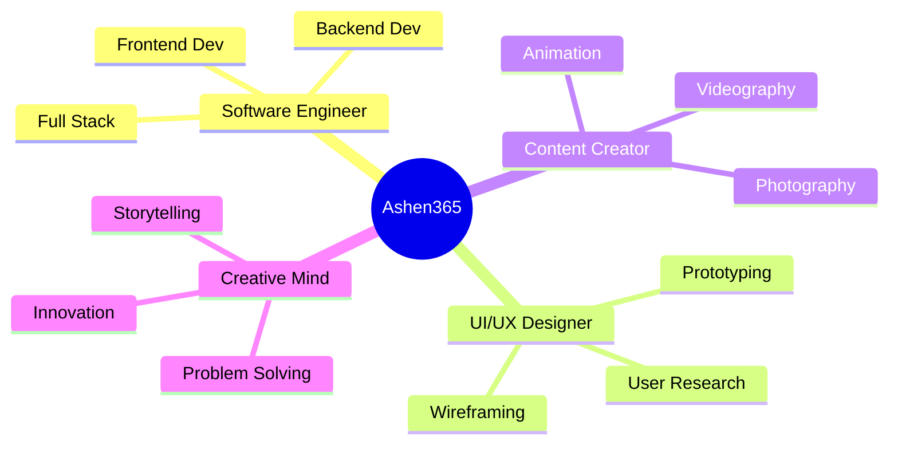

<div align="center">

# 👋 Hello, I'm Ashen Shanilka Herath

### Creative Developer | UI/UX Designer | Full Stack Developer | Content Creator

[](https://www.instagram.com/ashen_shanilka_herath/)
[](https://www.linkedin.com/in/ashen-herath-b88879257/)
[](https://www.youtube.com/@MonkeyMusichub)
[](mailto:ashen365@gmail.com)

</div>

---

## 🎯 About Me

```yaml
name: Ashen Shanilka Herath
username: Ashen365
location: Sri Lanka
education: SLIIT – Faculty of Computing
role: Software Engineer | UI/UX Designer
experience: 2+ years in UI/UX Design
```

> 💡 I turn **stories into software** and **ideas into animations** 🎥✨

---

## 🛠️ Tech Stack

### 💻 Frontend Development


### ⚙️ Backend Development


### 🗄️ Databases


### 🎨 Design & Creative


---

## 🌱 Currently Learning

<table>
  <tr>
    <td align="center" width="50%">
      <h3>🧑‍💻 Development</h3>
      <ul align="left">
        <li>📘 Advanced Java (OOP, DSA, Multithreading)</li>
        <li>🎯 Design Patterns</li>
        <li>🔧 Spring Boot REST APIs</li>
        <li>🎨 Advanced React.js + Tailwind CSS</li>
      </ul>
    </td>
    <td align="center" width="50%">
      <h3>📊 Data & Algorithms</h3>
      <ul align="left">
        <li>🧠 Data Structures & Algorithms</li>
        <li>🐘 SQL Optimization</li>
        <li>🍃 MongoDB Advanced Queries</li>
        <li>⚡ Performance Optimization</li>
      </ul>
    </td>
  </tr>
</table>

---

## 👀 Interests & Passions

<div align="center">

| 🎨 **Design** | 💻 **Development** | 🎬 **Content Creation** |
|:---:|:---:|:---:|
| UI/UX Design | MERN Stack | Short Films |
| Motion Graphics | Spring Boot | Animation |
| Creative Frontend | Full Stack Web | Viral Content |

</div>

---

## 🤝 Let's Collaborate On

```javascript
const collaborationInterests = {
  projects: [
    "🌟 Open-source projects with modern UI/UX",
    "📚 Educational or skill-sharing platforms",
    "📱 Innovative mobile and web applications",
    "🎨 Creative frontend experiences",
    "🎥 Content creation tools & platforms"
  ],
  lookingFor: "Passionate developers, designers, and creators!",
  availability: "Open to exciting opportunities"
};
```

---

## 📊 GitHub Stats

<div align="center">
  


</div>

---

## 💼 What I Do

<div align="center">



</div>

---

## ⚡ Fun Facts

- 🌙 I can design a UI while editing a short film at 3AM
- 🎨 I believe every app should tell a story
- 📸 Photography taught me to see details in code
- 🎬 My code is as clean as my video edits
- ☕ Powered by coffee and creativity

---

## 📫 Get In Touch

<div align="center">

### Let's build something amazing together! 🚀

📧 **Email:** ashen365@gmail.com  
📱 **Instagram:** [@ashen_365](https://www.instagram.com/ashen_shanilka_herath/)  
📸 **YouTube:** [Monkey Music](https://www.youtube.com/@MonkeyMusichub)  
💼 **LinkedIn:** [Ashen Shanilka Herath](https://www.linkedin.com/in/ashen-herath-b88879257/)

---


**He/Him** | **Based in Sri Lanka** 🇱🇰 | **Open to Opportunities** ✨

</div>
