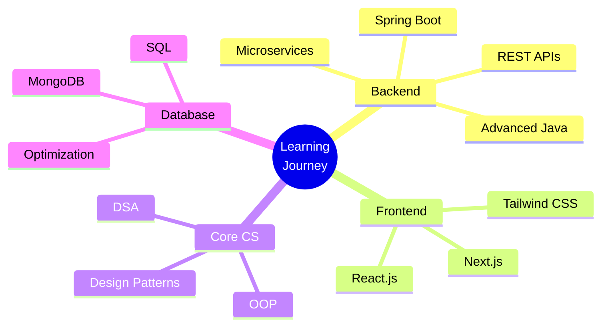

<div align="center">

# 🌟 Ashen Shanilka Herath

```ascii
╔══════════════════════════════════════════════════════════════╗
║                                                              ║
║     ✨ Crafting Digital Experiences & Visual Stories ✨     ║
║                                                              ���
║        💻 Code  •  🎨 Design  •  📸 Create  •  ✨ Inspire    ║
║                                                              ║
╚══════════════════════════════════════════════════════════════╝
```

<p>
  <a href="mailto:ashen365@gmail.com"></a>
  <a href="https://www.linkedin.com/in/ashen-herath-b88879257/"></a>
  <a href="https://www.instagram.com/ashen_shanilka_herath/"></a>
  <a href="https://www.youtube.com/@MonkeyMusichub"></a>
</p>


</div>

---

## 👨‍💻 About Me

```typescript
const ashenShanilka = {
  name: "Ashen Shanilka Herath",
  username: "@Ashen365",
  location: "🇱🇰 Sri Lanka",
  education: "🎓 SLIIT – Faculty of Computing",
  
  roles: [
    "💻 Full Stack Developer",
    "🎨 UI/UX Designer (2+ Years)",
    "📸 Photographer & Videographer",
    "🎬 Content Creator"
  ],
  
  currentFocus: [
    "Building scalable web applications",
    "Creating stunning user experiences",
    "Learning advanced Java & Spring Boot",
    "Producing creative visual content"
  ],
  
  motto: "Stories into Software • Ideas into Animations",
  workMode: "☕ Coffee → 💡 Ideas → 💻 Code → 🚀 Deploy"
};
```

<br/>

## 🛠️ Tech Stack & Tools

<div align="center">

### 💻 Development


### 🎨 Design & Creative


</div>

<br/>

## 🎯 What I Do

<div align="center">

<table>
<tr>
<td align="center" width="33%">

### 🎨 **Design**
UI/UX Design<br/>
Motion Graphics<br/>
Prototyping<br/>
Brand Identity<br/>
Wireframing

</td>
<td align="center" width="33%">

### 💻 **Development**
Full Stack Web Dev<br/>
MERN Stack<br/>
Spring Boot APIs<br/>
React + Tailwind<br/>
Database Design

</td>
<td align="center" width="33%">

### 🎬 **Content**
Short Films<br/>
Photography<br/>
Videography<br/>
Video Editing<br/>
Social Media

</td>
</tr>
</table>

</div>

<br/>

## 🚀 Currently Exploring

<div align="center">



</div>

<br/>

## 💡 Open to Collaborate On

<div align="center">

```diff
+ 🌐 Open-source projects with stunning UI/UX
+ 📚 Educational & skill-sharing platforms
+ 📱 Innovative mobile and web applications
+ 🚀 Creative tech solutions that make a difference
+ 🎨 Design systems and component libraries
+ 🎬 Tech + Creative content collaborations
```

</div>

<br/>

## 📊 GitHub Stats

<div align="center">


</div>

<div align="center">


</div>

<br/>

## 🏆 GitHub Trophies

<div align="center">


</div>

<br/>

## ⚡ Fun Facts

```python
class AshenShanilka:
    def __init__(self):
        self.pronouns = "He/Him"
        self.location = "Sri Lanka 🇱🇰"
        self.superpower = "Designing UI while editing films at 3AM"
        self.fuel = "☕ Coffee (lots of it)"
        self.philosophy = "Code is poetry, Design is art"
        
    def daily_routine(self):
        activities = [
            "☕ Start with coffee",
            "💻 Write clean code",
            "🎨 Design beautiful interfaces",
            "📸 Capture moments",
            "🎬 Edit creative content",
            "🚀 Deploy & iterate"
        ]
        return activities
        
    def life_motto(self):
        return """
        ✨ Turn stories into software
        ✨ Transform ideas into animations
        ✨ Build the future, one pixel at a time
        """

# Initialize
dev = AshenShanilka()
print(dev.life_motto())
```

<br/>

## 📈 Contribution Graph

<div align="center">

[](https://github.com/Ashen365)

</div>

<br/>

## 🎵 Spotify Playing

<div align="center">

[](https://open.spotify.com/user/YOUR_SPOTIFY_ID)

</div>

---

<div align="center">

### 💭 Quote of the Day


</div>

---

<div align="center">

## 🤝 Let's Connect & Create Together!

```ascii
╔═══════════════════════════════════════════════════════════════╗
║                                                               ║
║   🌟 "Building the future, one pixel and one line            ║
║       of code at a time" 🌟                                   ║
║                                                               ║
║   💼 Open to freelance opportunities                          ║
║   🤝 Available for interesting collaborations                 ║
║   📫 Always happy to connect with fellow creators!            ║
║                                                               ║
╚═══════════════════════════════════════════════════════════════╝
```

<br/>

### 🌐 Find Me Across The Web

<a href="mailto:ashen365@gmail.com">
  
</a>
<br/>
<a href="https://www.linkedin.com/in/ashen-herath-b88879257/">
  
</a>
<br/>
<a href="https://www.instagram.com/ashen_shanilka_herath/">
  
</a>
<br/>
<a href="https://www.youtube.com/@MonkeyMusichub">
  
</a>

<br/><br/>

```ascii
    ┌──────────────────────────────────────────────┐
    │                                              │
    │  ✨ Thanks for visiting my profile! ✨      │
    │                                              │
    │     Let's create something amazing! 🚀       │
    │                                              │
    └──────────────────────────────────────────────┘
```

<br/>

**⭐ Star my repositories if you find them interesting!**

<br/>


</div>
